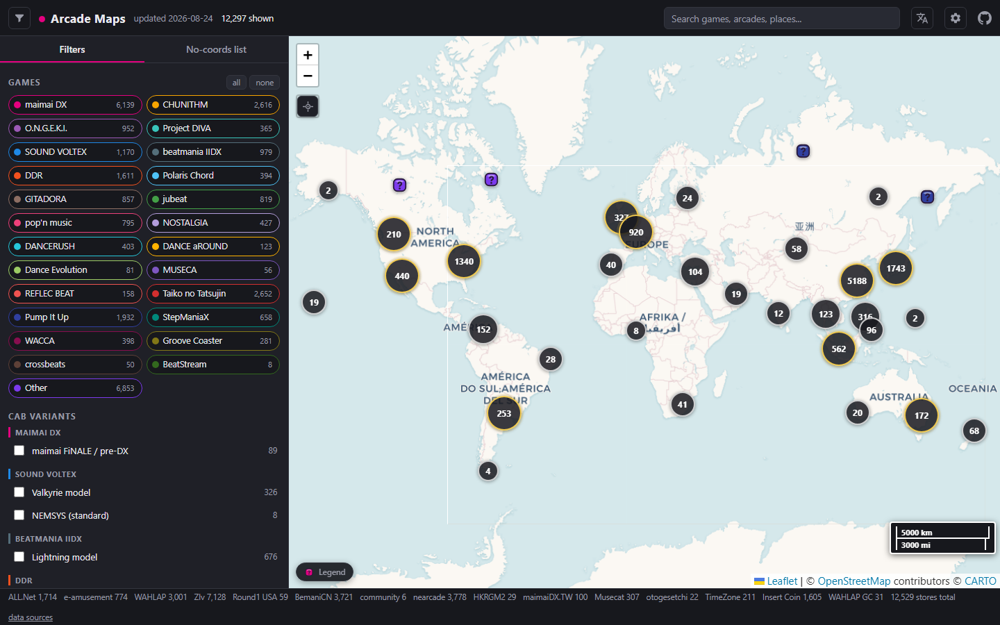

# Arcade Maps

## **[Open the live map](https://jonathanliu1401.github.io/Arcade-Maps/)**

[](https://github.com/JonathanLiu1401/Arcade-Maps/commits)
[](LICENSE)

Worldwide rhythm game arcade locations on one interactive map. Arcade Maps tracks where you can play CHUNITHM, maimai DX, ONGEKI, SOUND VOLTEX, beatmania IIDX, DanceDanceRevolution, Polaris Chord, GITADORA, jubeat, pop'n music, Nostalgia, DANCERUSH STARDOM, DANCE aROUND, Project DIVA Arcade, Pump It Up, StepManiaX, WACCA, Groove Coaster, crossbeats, BeatStream, and community-tracked games including Taiko no Tatsujin. The data is rebuilt automatically from official operator sources (SEGA ALL.Net, Konami e-amusement, WAHLAP) plus the Zenius-I-Vanisher and BemaniCN community databases, committed to this repo on a weekly schedule, and served as a fast static Leaflet map on GitHub Pages.

**Current dataset (last rebuild):** 13,540 arcades across 68 countries (191 cross-source duplicates were unified by romanization-aware matching, so a Japanese official listing and its romaji community twin now share one pin; a further 124 where two sources geocoded the same venue more than 120 m apart - ALL.Net's fullwidth "アミューズメントパークＭＧ西条" and e-amusement's "アミューズメントパークMG西条店" were one store drawn as two icons; and 22 in Hong Kong and Macau, where the official English listing and BemaniCN's Chinese one share no characters at all and are bridged by the street number, the operator's Latin branding, or the Cantonese reading of the Chinese name - 碧富遊戲機 on 和宜合道 is PIK FU GAME CENTRE on Wo Yi Hop Road). Sources include SEGA ALL.Net, Konami eagate, WAHLAP China, BemaniCN, Round1 USA, and Zenius-I-Vanisher (65 country queries, plus a United States per-series crawl).

## Live map

**https://jonathanliu1401.github.io/Arcade-Maps/**



## Features

- One map, every game: per-game layer toggles with marker clustering, so you can show only the cabs you care about
- One search box for three things: type a game (`iidx`, `舞萌`) to switch that filter on, a store name to fly to it, or a city (`Osaka`, `大阪`) to zoom to its arcades. Japanese, Chinese and romaji all match
- Store detail panel: click any marker and a full-height panel (a drag-to-expand bottom sheet on phones) opens with the store's games and per-game cab counts, address, source badges, notes, and buttons for directions, share-this-store link, and nearby
- Nearby search: the locate button (or any store's Nearby button) ranks the closest arcades by great-circle distance with a compass bearing, and honours whatever game, cab and source filters are active
- Settings you keep: turn individual data sources off, flatten the marker size ramp so every icon draws at 25px (the tier shapes stay), and disable location features entirely. Choices persist per device in localStorage and never travel in a shared link. The on-map legend is a click-to-expand chip, not a setting
- Tiered kawaii markers: each store draws one of six original chibi-style icons by total cabinet count (note, button pad, star, cat-ear chibi at 20-49 cabs, crowned idol at 50+, and a "?" pad when no source publishes a count). Each icon is tinted by the store's game colour, tiers only use counts a source actually reported, and at the deepest zoom a stacked bundle fans out (spiderfies) when you click it, so overlapping stores stay clickable
- Venue photos in the detail panel: 5,196 of 13,540 arcades (38.4%) now carry a real photo of that venue, shown as a slideshow when there is more than one and credited to the community member who took it. When a store has none, the panel falls back to a CC-licensed photo of one of its cabinets from Wikimedia Commons (with the required author/license credit rendered on the image), then to a game-colour banner. Coverage is uneven by design of the sources, not by choice: 51.1% in China (mirrored BemaniCN thumbnails), 37.4% in the United Kingdom, 35.2% in the United States, and only 3.3% in Japan. See "Photo coverage" below for why Japan is the outlier
- Resizable sidebar: drag the panel edge to any width (double-click resets), remembered per device
- Shareable URLs: the hash carries the map view plus selected games and cabs, and the Share button adds the exact store, so a link reopens on what you were looking at
- Official-source data: SEGA ALL.Net, Konami eagate facility search, and WAHLAP (China) are scraped directly, not copied from other maps
- Community coverage where official sources stop: Zenius-I-Vanisher fills in worldwide arcades (65 countries queried at the last pull), Taiko, offline cabs for retired games, and the extra series a US per-series crawl reaches. Six of those now have layers of their own rather than sitting in the grey "Other" chip: Pump It Up (1,557 venues), StepManiaX (596), WACCA (253), Groove Coaster (224), crossbeats (50) and BeatStream (8). In The Groove, Guitar Hero Arcade, Beat Saber and StepMania still map to Other
- Machine counts where sources report them, each labelled with the evidence behind it: `game_counts` covers 4,470 arcades (33.0%; BemaniCN raw coverage is ~94% of its shops), and a parallel `count_evidence` records per game slug whether the number is a published quantity (`bemanicn_qty`), a human writing "12 machines" on the listing (`ziv_comment`), or simply the number of machine rows on a ZIv page (`ziv_listed`, a FLOOR rather than a total). A `ziv_listed` count of 1 renders nothing at all: ZIv lists one row per title regardless of how many cabinets stand behind it, so "x1" would be a number no source published. Cabinet-variant pills follow the same rule one level down through `cab_models`, and only take a quantity when the listing comment NAMES the cabinet model
- Measured prices, not guessed ones: `scrapers/prices.py` derives a per-country per-game figure from the real quoted prices in the listings and tiers it by how much evidence there is - measured (5 or more quotes), sparse (2 to 4, shown with a caveat), unknown (renders nothing rather than a fabrication). The current table holds 116 measured cells, 113 sparse and 87 unknown across 29 countries. This replaced a hand-written country table that asserted "HKD 8-15/play typical" for Hong Kong, where every listing in the dataset quotes HK$6.00. Weekly USD FX rates come from Frankfurter (ECB) with open.er-api.com gap-fill, so the site can show a local price and a converted estimate
- Community enrichment: `data/enrichment.json` covers 9,795 of the 13,540 arcades - opening hours (5,259), venue info text (4,241), a website (4,095), free-text machine prices per game (3,664), and venue photos (5,196). The text fields are all ZIv; the photos that reach the shipped file come from ZIv and BemaniCN only. `scrapers/enrich.py` also parses the other BemaniCN fields (transit prose, venue coin/token price, per-title coins per play, game versions, favourite counts), but photos are the only BemaniCN data that has landed in the shipped file so far
- Directions: every store links out to Google Maps, by coordinate when it has one and by name + address search when it does not
- Street-level China placement, still labelled approximate: coordinate-less mainland China addresses are geocoded through Baidu's keyless public endpoint and the answers are committed to `data/china_geocode.json`, which moved China from 2,090 distinct coordinates to 5,305. Every one of those pins still carries `approx: true`, and the reason is worth reading rather than skipping. See the China accuracy disclosure below
- Automated freshness: a GitHub Action re-scrapes weekly and commits the diff, so the badge above tells you exactly how stale the data is
- Google My Maps export: numbered KMZ layers in `mymaps/` let you rebuild the classic My Maps experience in your own Google account (see [docs/MYMAPS.md](docs/MYMAPS.md))
- No backend, no API keys: static HTML + vendored Leaflet 1.9.4 + Leaflet.markercluster 1.5.3 on GitHub Pages, OpenStreetMap raster tiles. The one optional exception is the Google Places photo path, which stays a complete no-op unless somebody adds their own key ([docs/GOOGLE_PHOTOS.md](docs/GOOGLE_PHOTOS.md))

## China accuracy disclosure

**Mainland China marker positions are approximate. A pin can be the building next door, and most often it is the mall the arcade sits inside.**

Every Chinese primary source used here (WAHLAP's official venue API and BemaniCN's public Inertia shop endpoints) publishes store **addresses without coordinates**. BemaniCN's map layers that carry lat/lng are login-walled. No Chinese source in this project publishes a surveyed WGS-84 position for its venues, so every China pin that is not inherited from a community source is derived rather than published.

What the map does, in order:

1. Prefer a real coordinate when one exists (a ZIv community pin, or a WAHLAP/BemaniCN row that merged with a coordinate-bearing twin). **650 China entries** have one.
2. Otherwise geocode the printed address. `scrapers/geocode_cn.py` asks Baidu's keyless public endpoint, converts the answer from BD-09 through GCJ-02 to WGS-84, and commits it to `data/china_geocode.json` so an ordinary build makes no request at all. Three gates apply to every answer: a mainland bounding box, an area check that requires the city the address named to be the city the answer came back in, and a district check that runs again at read time so answers committed before the gate existed are re-checked too. **5,757 entries** are placed this way.
3. Where the address resolves to no usable coordinate, fall back to the centroid of the finest administrative unit `data/china_areas.json` can read out of it, the **district** (区/县) where the address names one and the prefecture-level **city** where it does not. That is now the rare case: **10 entries**, 7 district and 3 city.
4. **95 entries** stay coordinate-less and appear only in the no-coords list, with their address intact.

### Why every geocoded pin still says "approximate"

This is the part that matters, and it is deliberately not buried.

Baidu's keyless endpoint is a **POI search**, not a rooftop geocoder. When it answers "poi precision" it is telling you the result was *a building*, never that it was *this building*. For an arcade inside a shopping mall, which is most of them, the top hit is routinely the mall itself: 1号机长合肥瑶海天地店 resolves to 瑶海天地, the shopping centre it holds a unit of. When the query is thin the answer can be a different branch in a different city entirely, which is how one venue in 澧县 briefly took the coordinate of a 欢乐城 in 武陵区, 64 km away, and asserted it without a caveat.

The obvious repair, clearing the flag only where the answer can be confirmed to name the arcade rather than its mall, was built and then measured. It does not work. Three successive discriminators confirmed 2,547, then 1,240, then 230 of the roughly 5,770 flagged rows, and every one of them was wrong in both directions: a KFC and two shopping centres came back "confirmed", while 1-7PLAY家庭娱乐中心(唐山中骏世界城店), plainly the arcade, came back "not confirmed". A test that is roughly a fifth wrong is not something to remove a caveat with, so nothing is cleared and the clearing loop was deleted rather than tuned.

**So all 5,767 placed China entries carry `approx: true`,** and the detail panel says which kind of approximation it is: "Position from the address" for a geocoded pin, "Position approximate - district level" or "city level" for a centroid. The count going up rather than down is the intended outcome. The metric that actually tracks pin quality is not the flag, it is how many rows share a coordinate while claiming precision, and that went from 2,032 to 2. China's distinct coordinates went from 2,090 to 5,305, and the worst pile-up on one point went from 69 venues to 6.

A few venues no geocoder resolves have been researched by hand into `data/china_manual_coords.json`. Every record there carries the source URL the coordinate was read off, because a coordinate nobody can audit is indistinguishable from one somebody invented, and any record without one is refused. Each also carries the venue's name as a safety interlock: merge renumbers arcade ids on every build, so a record whose venue has shifted id is refused rather than silently applied to whichever store now holds that number.

**Addresses remain authoritative.** For navigation, copy the address into a local map app (AMap, Baidu Maps, Apple Maps, Google Maps) rather than trusting the pin.

Taiwan, Hong Kong and Macau are never approximated and never geocoded here (ZIv, ALL.Net and e-amusement cover all three with real pins). District remains as far as the free administrative data reaches: the upstream release publishes 乡镇/街道 boundaries only as a paid asset.

Refreshing the cache is opt-in and never part of a normal build, because it is hours of polite serial requests: `python scrapers/run_all.py --skip-scrape --only geocode`, then re-merge. `AMAP_KEY` or `GOOGLE_MAPS_API_KEY` are used when present; without either, the keyless Baidu path is what runs.

## Photo coverage

**5,196 of 13,540 arcades (38.4%) have a real photo of the venue**, from two sources in the shipped file: BemaniCN thumbnails mirrored into `assets/venues/` (3,193 arcades) and ZIv community uploads (2,003). A third source, a small hand-reviewed set from Wikimedia Commons, is harvested into `data_raw/chain_photos.json` (48 image records) but **currently reaches no arcade on the map**: `photos.index_by_source_url()` keys the join on `ziv:<id>` / `bemanicn:<id>` derived from `page_url`, and a `commons.wikimedia.org` page URL produces no key, so `enrich.py` drops every Commons-only photo. Shipped enrichment contains zero of them. The BemaniCN images are mirrored rather than linked because that site serves them from signed URLs that expire within the hour, so a stored link would be dead by the time anybody clicked it. Licence position, per-file attribution and the takedown path are in [`assets/venues/ATTRIBUTION.md`](assets/venues/ATTRIBUTION.md). `scrapers/photo_quality.py` ranks each venue's photos from their file headers (dimensions, aspect, bytes per pixel, and the upload timestamp in the filename) so the best one takes the hero slot instead of whichever came back first.

Coverage is very uneven, and two of the gaps are worth stating plainly:

- **Japan is 3.3%** (46 of 1,397), the worst of any major market. Japanese chain store pages scrape at 95 to 100 percent technically, and are unusable anyway: Taito and namco explicitly forbid copying, transmitting or deep-linking their images, which is exactly what embedding them on a public map would be. Those chains are therefore link-outs to the official store page, and a link-out counts as zero coverage.
- **Street-level imagery was measured and rejected.** KartaView, Mapillary, Wikimedia Commons geosearch, OSM `image=*` tags and Wikidata P18 were probed against a fixed-seed sample of 210 arcades. Only 5.2% of arcades have any street-level photo with a camera even pointed at them, and of the best-case frames actually downloaded and looked at, 0 of 7 showed an arcade: all were windshield dashcam shots of asphalt, because dashcams photograph roads rather than shops. The full measurement lives in `data_raw/streetlevel_imagery_probe.json` so nobody has to redo it.

**Google Places photos are an optional fourth source**, off by default and a clean no-op without an API key. Place IDs are cached (Google's terms exempt them explicitly); photos are fetched in the browser when a panel opens and are never stored anywhere, because the terms forbid caching those. Setup, costs, and how a match is verified before it is trusted: [docs/GOOGLE_PHOTOS.md](docs/GOOGLE_PHOTOS.md).

## Quick start

**Just browse:** open the [live map](https://jonathanliu1401.github.io/Arcade-Maps/), toggle game layers, click a marker for the store name, address, and game list.

**Use it in Google My Maps:** import the numbered `mymaps/01_*.kmz` ... `10_*.kmz` files as layers into a new map at https://www.google.com/maps/d/. Full walkthrough: [docs/MYMAPS.md](docs/MYMAPS.md).

**Run the scrapers yourself:**

```
git clone https://github.com/JonathanLiu1401/Arcade-Maps.git
cd Arcade-Maps
python scrapers/run_all.py                 # scrape all sources, merge into data/, rebuild mymaps/
python scrapers/run_all.py --skip-scrape   # re-merge + rebuild from existing data_raw/ (no network)
```

The scrapers are stdlib-only (Python 3.12 or newer); there is nothing to pip install. Please keep the built-in politeness settings (sequential fetching, delays between requests) if you run the scrapers. Details per source: [docs/DATA_SOURCES.md](docs/DATA_SOURCES.md).

## Data sources

| Source | Games | Coverage | Coordinates | Refresh path |
|---|---|---|---|---|
| SEGA ALL.Net (location.am-all.net) | maimai DX JP + International (gm 96 / 98), CHUNITHM JP + International (gm 109 / 104), ONGEKI (gm 88), Project DIVA Arcade (gm 34) | Japan (47 prefectures via ct=1000) + 15 international country codes | Yes (official) | ALL.Net scraper, weekly Action |
| Konami eagate facility search (p.eagate.573.jp) | 20 game keys: IIDX, SDVX, DDR, GITADORA (GF/DM), jubeat, pop'n, Nostalgia, DANCERUSH, DANCE aROUND, Polaris Chord (PLRS), MUSECA, REFLEC BEAT, DanceEvolution, and cab variants (SDVX Valkyrie, IIDX Lightning, DDR gold cab, plus Arena and Pikapika variants) | Japan only (verified live: the facility search exposes no overseas listings) | Yes (official, `data-latitude` / `data-longitude`) | eagate scraper, weekly Action |
| WAHLAP official REST (sega-register.wahlap.net) | maimai DX CN, CHUNITHM CN (3,207 merged source rows at last refresh) | Mainland China | No (addresses only; geocoded from the address, still `approx: true`) | WAHLAP scraper, weekly Action |
| Zenius-I-Vanisher community DB | Everything the community tracks, incl. Taiko, Pump It Up, StepManiaX, WACCA, Groove Coaster, offline cabs of retired games, and the remaining US extra series under `other` | Worldwide, 65 country queries at last pull (6,989 merged source rows) | Yes (community-pinned) | ZIv JSON API, weekly Action |
| Round1 USA (Storepoint API) | Standard Round1 rhythm lineup (assumed per chain standard, not per-store verified) | United States | Yes | Round1 scraper, weekly Action |
| BemaniCN community map (map.bemanicn.com) | Community-tracked China listings: maimai DX, CHUNITHM, Taiko, and the wider Bemani lineup, with per-store game lists and per-title machine counts (3,576 shops), plus one venue thumbnail per shop | Mainland China (392 city indexes; 3,802 merged source rows) | No (public Inertia endpoints publish addresses + game lists; the coordinate map layers are login-only; geocoded from the address in merge) | BemaniCN scraper, weekly Action; photos by a separate manual crawl |

Deep per-source detail (exact URLs, parse markers, caveats): [docs/DATA_SOURCES.md](docs/DATA_SOURCES.md).

## Known gaps

- **China coordinates are approximate.** WAHLAP and BemaniCN publish addresses without lat/lng, so almost every China pin is geocoded from its printed address and carries `approx: true`. A POI search answers with a building, not necessarily with THIS building. See the China accuracy disclosure above.
- **BemaniCN map layers are login-walled.** Public endpoints give addresses + game lists + per-title machine counts + one venue thumbnail; exact coordinates still require a login the scraper does not use. The shop detail pages also expose transit prose, prices and hours, but the crawl behind the shipped `data_raw/china_bemanicn.json` captured none of those, so photos are the only BemaniCN field reaching `data/enrichment.json` today.
- **Photo coverage is thin in Japan and Taiwan** (3.3% and 3.4%) because the chains that dominate those markets forbid embedding their store imagery. See "Photo coverage" above.
- **CHUNITHM US:** SEGA's ALL.Net locator currently lists zero official CHUNITHM locations in the US. US CHUNITHM cabs appear only via community sources (ZIv) and the Round1 lineup assumption.
- **Konami overseas:** the eagate facility search is Japan-only, so overseas Bemani cabs (US Round1, Asia, Europe) come only from ZIv / community data.
- **Near-extinct games:** Project DIVA Arcade, MUSECA, REFLEC BEAT, and DanceEvolution have almost no surviving official listings; they are tracked mostly through ZIv offline-cab records.
- Listings lag reality in both directions: stores close, cabs move, and official locators update on their own schedule. Community prices, hours, and venue notes can be outdated; check `enriched_at` where shown.

## Update cadence

A GitHub Action re-runs every scraper weekly (Monday 18:00 UTC, plus manual `workflow_dispatch`) and auto-commits changed data files with a bot identity. The "last data update" badge above reflects that commit.

## Repository layout

```
Arcade-Maps/
|- index.html            interactive map (GitHub Pages entry point)
|- js/                   map logic, one plain script per module, loaded in
|                        dependency order (see docs/ARCHITECTURE.md):
|  |- state.js           constants, helpers, loaded data, the state store
|  |- format.js          distance / count / money / FX formatting
|  |- mapcore.js         Leaflet map, panes, URL hash sync
|  |- tier-icons.js      GENERATED tier artwork strings (tools/build_tier_icons.py)
|  |- markers.js         cluster layer, visibility predicate, tier icons, spiderfy
|  |- gphotos.js         optional Google Places photos (no-op without a key)
|  |- search.js          omnibox over games, arcades and places
|  |- panel.js           filter drawer, no-coords tab, store detail panel
|  |- settings.js        settings dialog, source toggles, legend chip
|  |- nearby.js          locate control and nearest-arcades list
|  |- app-init.js        fetch, seed state, build and start every module
|- style.css             styling
|- vendor/               vendored Leaflet 1.9.4 + markercluster + SmoothWheelZoom
|- assets/               favicon, tier marker SVGs, CC-licensed cab photos
|  |- venues/            mirrored venue photos + ATTRIBUTION.md (credit, licence, takedown)
|- data/                 merged JSON (arcades, stats, enrichment incl. measured prices,
|                        fx rates, china areas / geocode cache / manual coords,
|                        merge log), auto-committed weekly
|- data_raw/             per-source scraped rows + photo sidecars, auto-committed weekly
|- scrapers/             per-source scrapers + merge / geo_validate / china_place / enrich / fx
|  |- run_all.py         run the full pipeline (scrape -> merge -> mymaps -> fx)
|  |- geocode_cn.py      keyless China address geocoding -> data/china_geocode.json
|  |- cn_address.py      Chinese address parsing into progressively coarser queries
|  |- prices.py          measured per-country per-game prices from quoted listings
|  |- photos.py          ZIv venue-photo harvest
|  |- bemanicn_photos.py mirror BemaniCN thumbnails into assets/venues/cn/
|  |- chain_photos.py    ZIv full-country photo sweep, Commons, chain link-outs
|  |- photo_quality.py   rank a venue's photos from their file headers
|  |- streetphotos.py    street-level imagery probe (measured, rejected, ships empty)
|  |- place_ids.py       optional Google place-ID resolution (opt-in, needs a key)
|  |- guard_regression.py  block a commit when a crawl shrinks implausibly
|  |- build_mymaps.py    regenerate the Google My Maps KMZ/CSV layers
|- tools/
|  |- build_tier_icons.py  embed assets/markers/*.svg into js/tier-icons.js
|  |- stamp_assets.py    content-hash ?v= stamps on the css/js in index.html
|- mymaps/               numbered KMZ layers for My Maps import (+ README)
|- docs/
|  |- ARCHITECTURE.md    pipeline, data schema, design decisions
|  |- DATA_SOURCES.md    per-source URLs, parse markers, caveats
|  |- GOOGLE_PHOTOS.md   optional Google Places photos: setup, cost, match rules
|  |- MYMAPS.md          Google My Maps import walkthrough
|  |- PRIOR_ART.md       projects studied while designing this one
|  |- UPDATING.md        weekly Action details + manual refresh guide
|- .github/workflows/    weekly scrape + auto-commit Action, manual smoke test
|- README.md
|- LICENSE
```

## Credits

Prior art studied while designing this project (protocols and recipes, no code copied from unlicensed repos):

- [bemusicscript/gcm-storefinder](https://github.com/bemusicscript/gcm-storefinder) - ALL.Net scraping recipe + Leaflet/markercluster static-site pattern
- [hker9527/otoge-locator](https://github.com/hker9527/otoge-locator) - daily-cron + auto-commit architecture proof
- [djzmo/otoge-app](https://github.com/djzmo/otoge-app) - multi-source scraper suite, eagate facility-search recipe
- [Naptie/nearcade](https://github.com/Naptie/nearcade) (MPL-2.0) - China data-source landscape and demand validation
- [googollee/eviltransform](https://github.com/googollee/eviltransform) (BSD-2-Clause) - GCJ-02 / BD-09 to WGS-84 conversion, vendored
- [xiangyuecn/AreaCity-JsSpider-StatsGov](https://github.com/xiangyuecn/AreaCity-JsSpider-StatsGov) (MIT) - China province / city / district centroids underlying `data/china_areas.json`
- [rime/rime-cantonese](https://github.com/rime/rime-cantonese) (CC BY 4.0, 粵語計算語言學基礎建設組 / CanCLID) - Cantonese readings underlying `data/hk_romanize.json`, which is how a Hong Kong venue's English name is matched to its Chinese one
- [Leaflet](https://leafletjs.com/) and [Leaflet.markercluster](https://github.com/Leaflet/Leaflet.markercluster) - the map engine
- [OpenStreetMap](https://www.openstreetmap.org/copyright) contributors - base map tiles
- [Frankfurter](https://www.frankfurter.app/) / ECB reference rates - weekly FX bake
- The [Zenius-I-Vanisher](https://zenius-i-vanisher.com/) community - decades of worldwide arcade tracking, including the venue photos its members uploaded
- The [BemaniCN](https://map.bemanicn.com/) community - China venue listings, machine counts, and the venue thumbnails mirrored under `assets/venues/cn/`
- [Wikimedia Commons](https://commons.wikimedia.org/) contributors - the CC-licensed venue and cabinet photographs, credited per file

## License and disclaimer

Code in this repository is MIT licensed (see LICENSE). Location data belongs to the respective operators (SEGA, Konami, WAHLAP) and community maintainers; it is republished here for player convenience only. Photographs under `assets/venues/` are **not** MIT and are not relicensed by this repository: see [`assets/venues/ATTRIBUTION.md`](assets/venues/ATTRIBUTION.md) for each source's position and the takedown path. Listings can lag reality: stores close, machines move, and hours change. China map pins that carry `approx: true` are derived from the printed address rather than surveyed, and a POI search answers with a building rather than necessarily with the right one (see the China accuracy disclosure). Verify with the venue before traveling any distance to play.
