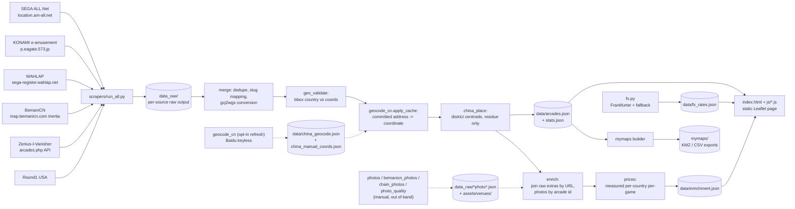
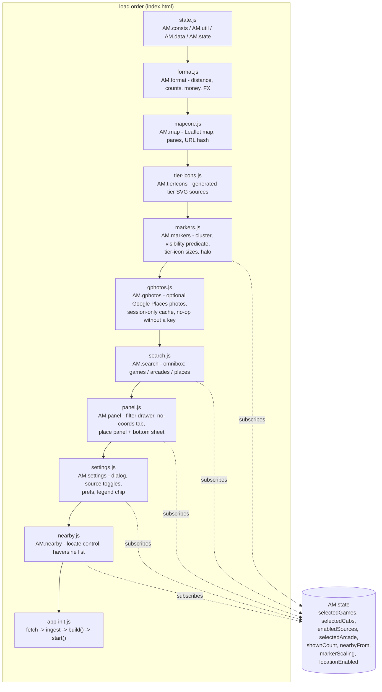

# Architecture

## Pipeline



One weekly GitHub Action (see `docs/UPDATING.md`) runs scrape -> merge (including geo validation, China placement, and enrichment) -> My Maps rebuild -> FX bake, then commits the results. The static site is a pure function of `data/arcades.json` plus on-demand `data/enrichment.json` and `data/fx_rates.json`. FX failure is non-fatal (previous rates retained).

**Dotted edges are out of band.** The China geocode refresh and every photo harvest are manual steps that write a committed artefact; the weekly build only ever READS those artefacts. Nothing on merge's path opens a socket for either. That is what keeps a keyless CI run producing the same output as a developer's machine:

| Step | Run by | Reads / writes |
|---|---|---|
| `geocode_cn.py` | `run_all.py --only geocode`, by name only | writes `data/china_geocode.json`; merge only reads it |
| `photos.py`, `chain_photos.py` | manual | write `data_raw/ziv_photos.json`, `data_raw/chain_photos.json` |
| `bemanicn_photos.py` | manual | writes `assets/venues/cn/*.jpg` + `data_raw/bemanicn_photos.json` |
| `photo_quality.py` | manual | writes `data_raw/photo_quality.json` + probe cache |
| `streetphotos.py` | manual | writes `data_raw/street_photos.json`, deliberately empty |
| `place_ids.py` | manual, needs a Google key | writes `data/place_ids.json` (not in the tree today); see `docs/GOOGLE_PHOTOS.md` |
| `prices.py` | inside `enrich`, so weekly | reads the enrichment rows, writes the `prices` block |

### Merge stage order (inside `scrapers/merge.py`)

1. Load raw units, within-source dedupe, supersede bundled `community.json` rows when fresh files exist
2. Cross-source cluster / merge, optional coordinate inheritance. Four tiers,
   each only able to ADD merges to the previous one:
   `dist+name` (fuzzy name, similarity >= 0.6, within 120 m, mutual best),
   the romanization-aware proximity tier in `name_match.py` (official vs
   community only, within 30 m),
   `exact-name-locality` (exact name match after NFKC and trailing `店`
   removal, cross-source, same country, within 3 km, mutual nearest, repeated
   to a fixed point so a three-source venue folds fully rather than one pair
   at a time),
   `exact-name-branch-suffix` (one source has the bare venue name and the
   other appends a branch in parentheses, cross-source, within 600 m, and
   merged ONLY when the bare row has exactly one candidate in range so a bare
   chain name cannot attach itself to an arbitrary branch),
   and `same-source-dup` (identical compact name within 30 m, one source
   listing a store twice).
   "Exact name match" means any of: equal full compact names; one side's
   PARENTHETICAL equal to the other's full name, which is the ZIv bilingual
   shape `Romaji (日本語店名)`; or both sides sharing a parenthetical, which is
   usually a shopping centre rather than a store and therefore additionally
   requires the brands outside the parentheses to agree. The paren-STRIPPED
   form is never a key, so `GiGO(1号館)` and `GiGO(2号館)` cannot collapse.
   The same matcher backs the coordinate-less path, which is the only tier
   mainland China rows reach (their sources publish addresses without coords,
   and `china_place` runs after merge).
   Hong Kong and Macau get their own tier, `hk-cross-script`, because nothing
   above can pair an English official listing with BemaniCN's Chinese one:
   the names share no characters and the BemaniCN side has no coordinate to
   measure a distance from. It gathers independent KINDS of evidence between
   two clusters - street name, street number, locality, the operator's Latin
   brand, a shared Chinese venue name, and the venue name read aloud - and
   requires two of them. The reading is the interesting one: 碧富 is Pik Fu,
   和宜合 is Wo Yi Hop, 青柏 is Tsing Pak, and `scrapers/hk_match.py`
   reconstructs it from `data/hk_romanize.json` and folds Jyutping and Hong
   Kong's older government romanisation onto a shared phonetic skeleton before
   comparing. A shared street at conflicting numbers VETOES the pair, which is
   the one signal in the territory that positively separates two venues
   (觀塘道418號 is APM, 觀塘道410號 is a different arcade). Partners are then
   ranked by how many kinds of evidence back them, and a pair merges only when
   each side's best partner is the other and no runner-up ties it

3. Assign sequential ids after sort by country, name, address
4. **`geo_validate`** - source-aware country vs bounding-box checks (official: null bad geocodes; community: fix wrong country labels)
5. **`geocode_cn.apply_cache`** - place coordinate-less mainland China rows from the committed address cache (`data/china_geocode.json`), preceded by the hand-researched pins in `data/china_manual_coords.json`. Pure file reads: no request is ever made here. Every placed row gets `approx: true` and `approx_level: "address"`, and the district gate is re-run at READ time as well as fetch time, because thousands of answers were committed before the gate existed and `run()` never re-asks a cached hit. Rows whose cached answer resolves to the wrong district are refused and fall through to step 6
6. **`china_place`** - for whatever is still coordinate-less, resolve the deepest administrative unit the address names in `data/china_areas.json` (district, else prefecture-level city), place the pin on that centroid exactly, set `approx: true` and `approx_level` (never overwrites a real pin). Each level is gated by the one above it through the table's parent-id chain, so a district is only ever matched among the children of the city already resolved. Now the residue rather than the main path: 10 rows in the current build against 5,757 from the cache. Taiwan, Hong Kong and Macau are refused outright: the 香港 centroid is in Victoria Harbour, so approximating there put a scatter of pins in the water rather than on any street, and those territories are covered with real pins by ALL.Net, e-amusement and ZIv anyway
7. Write `data/arcades.json` + `data/stats.json`
8. **`enrich.build_enrichment`** - join raw BemaniCN/ZIv extras onto merged ids via `links.*` URLs, and venue photos via `data_raw/photo_index.json` by merged arcade ID; rank each venue's images with `photo_quality`; build the measured `prices` table; write `data/enrichment.json` (does not mutate arcade rows)
9. Write `data/merge_log.json` (includes `geo_validation`, `china_geocoded`, `china_geocode_rejected` and `china_approx` logs)

After merge returns, `run_all.py` rebuilds My Maps, then runs `fx.run` into `data/fx_rates.json`.

## Schema reference: `data/arcades.json`

```
{"updated": "YYYY-MM-DD",
 "counts": {"total": int,
            "by_game": {slug: int},
            "by_source": {src: int},
            "by_country": {country: int}},
 "arcades": [
  {"id": int (sequential after sorting by country,name,addr;
   renumbered on each refresh),
   "name": str,
   "addr": str (original language),
   "lat": float|null,
   "lng": float|null (WGS-84 ONLY; convert gcj02 via embedded
          eviltransform gcj2wgs, bd09 via bd2wgs, before writing;
          (0,0) or missing means null). For China rows with
          approx:true these are DERIVED, not surveyed: a geocoder's
          answer for the printed address (approx_level "address")
          or an administrative centroid ("district" / "city"),
   "country": str (English: "Japan","China","Taiwan","United States",...),
   "pref": str|null (JP prefecture / CN province / US state where known,
           original language ok),
   "games": [slug array, non-empty],
   "game_counts": {slug: int} (OPTIONAL - key absent when unknown;
          per-game machine counts, present only where a source
          reported them: BemaniCN per-title quantities and ZIv
          machine-list tallies, merged as per-slug max; every counted
          slug also appears in games; official sources publish no
          counts, so a store can list games without counts),
   "counts_src": "bemanicn"|"ziv"|null (OPTIONAL - present only when
          some source reported counts for this arcade. Names which
          source the surviving game_counts came from; BemaniCN wins
          when both contributed. null means counts existed but were
          ZIv placeholders (ZIv lists one row per game version, so a
          store that merely HAS a game tallies to 1 for it, and one
          that has two versions - or two titles sharing a slug, like
          GuitarFreaks and DrumMania under gitadora - tallies to 2)
          and were DROPPED, so game_counts is absent and nothing
          renders as "x1". ZIv counts survive only where some slug
          counts MORE machines than that row lists distinct titles for
          it: a repeated title is the one thing that proves the list
          was entered machine by machine. Key absent entirely = no
          source ever counted this arcade, which is distinct from a
          suppressed placeholder.
          Invariant: game_counts present <=> counts_src is non-null.
          Dropping counts never drops games),
   "count_evidence": {slug: "bemanicn_qty"|"ziv_comment"|"ziv_listed"}
          (OPTIONAL - present exactly when game_counts is, and its
          keys are a SUBSET of game_counts' keys. Says WHERE each
          number came from, because the three are not equally
          strong:
            bemanicn_qty  a published per-title quantity
            ziv_comment   a human wrote "12 machines" on the listing
            ziv_listed    N machine rows were enumerated. A FLOOR,
                          not a total, and the frontend suppresses
                          it entirely at n == 1: ZIv lists one row
                          per title however many cabinets exist, so
                          "x1" would assert something nobody
                          published. n >= 2 survives, hedged as
                          "listed". See js/state.js countIsShowable
                          and countIsQualified.
          Ranked bemanicn_qty > ziv_comment > ziv_listed when two
          sources cover the same slug; ties break on the larger
          count, and ranking happens BEFORE comparing so a
          comment-backed 3 beats a listed 9),
   "cab_models": {variant slug: int|null} (OPTIONAL - per-CABINET-MODEL
          quantities, one level below game_counts. The vocabulary is
          CAB_MODEL_SLUGS in merge.py, which is WIDER than "cabs"
          below (that is the e-amusement flag vocabulary): ddr_legacy,
          ddr_gold, ddr_universal, sdvx_vm, sdvx_nemsys, iidx_lm,
          taiko_jp, taiko_asia, taiko_us, gitadora_gf_arena,
          gitadora_dm_arena, popn_pikapika, maimai_classic,
          maimai_dx_cab. A null value means "this cabinet is here,
          quantity unknown", which is the common case: 1,306 rows
          carry cab_models and only 219 carry any number. A quantity
          is taken ONLY when the listing comment NAMES the model
          ("8 LIGHTNING MODEL machines"); a bare "8x" on a
          "SOUND VOLTEX (Valkyrie model)" row describes the GAME's
          machines, not the Valkyrie ones, and taking it made 230 of
          317 numbered pills byte-identical to their parent game's
          count. js/state.js then applies the same n >= 2 rule as
          ziv_listed),
   "cabs": [variant slugs among: sdvx_vm, iidx_lm, ddr_gold,
            gitadora_gf_arena, gitadora_dm_arena, popn_pikapika]
            (the e-amusement cab-variant FLAGS; see cab_models above
             for the wider per-model vocabulary and its quantities),
   "src": [ids among: allnet, eagate, wahlap, ziv, round1usa,
           bemanicn, community],
   "links": {"gmaps": str|null, "ziv": str|null, "bemanicn": str|null},
   "notes": str|null,
   "approx": true (OPTIONAL - present whenever the pin was DERIVED rather
          than published, by geocoding the address or by administrative
          centroid; never set on a real / inherited coordinate),
   "approx_level": "address"|"street"|"district"|"city" (OPTIONAL -
          present exactly when "approx" is, naming how the pin was
          derived. Current build: address 5,757, district 7, city 3.
          "street" is emitted by geocode_cn for a provider that
          reports street precision; the keyless Baidu path does not.
          js/panel.js has caption text for all four)}
 ]}
```

### `approx` field semantics

- Present and `true` for every derived pin. `approx_level` says HOW it was derived, not how confident it is.
- **`address` does not mean "this building".** It means the printed address was handed to a geocoder and something came back. Baidu's keyless endpoint is a POI search, so a "poi precision" answer says the result was a building, never that it was THIS building: for a venue inside a mall the top hit is routinely the mall. Three attempts to build a discriminator that could clear the flag for confirmed rows were measured and all failed in both directions, so the clearing step was deleted rather than tuned. The reasoning is written out at length in `merge.py` at the `geocode_cn.apply_cache` call, and in the README's China accuracy disclosure. Do not restore a clearing loop from the size of the number alone.
- `district` / `city` mean "somewhere in this unit; the address is authoritative and the pin is not a storefront".
- No fan-out for centroid rows: entries sharing an area sit on it exactly, so they cluster into one badge instead of impersonating separate street addresses.
- Entries that stay coordinate-less have no `approx` key and `lat`/`lng` null (sidebar / no-coords list).
- `links.gmaps` for those rows stays a name+address search URL; merge deliberately does not rewrite it to the derived pin.

### Game slugs (canonical, used by the site layers too)

`maimai_dx, chunithm, ongeki, project_diva, sdvx, iidx, ddr,
polaris_chord, gitadora, jubeat, popn, nostalgia, drs, dance_around,
dance_evo, museca, reflec, taiko, pump_it_up, stepmaniax, wacca,
groove_coaster, crossbeats, beatstream, other`

The last six were promoted out of `other` once ZIv proved it tracks them at
scale (Pump It Up alone is 1,557 venues). `merge.GAME_SLUGS` is the canonical
list and is what `js/state.js` layers off; a slug ziv.py emits that is not in
it silently reverts to `other`, which is exactly the bug that hid those six.

**maimai classic stays a cab VARIANT, not a slug**, and that is deliberate: a
FiNALE cabinet is a DX store's other cabinet rather than a separate venue
category, so it is modelled as `maimai_classic` in `cab_models`. Giving it a
slug too would make the 46 stores holding both render a "maimai" chip AND a
"FiNALE" badge for the same machine. See the comment at `merge.GAME_SLUGS`.

### Source-to-slug mapping

- `maimai_jp` + `maimai_intl` + WAHLAP `maidx` -> `maimai_dx`
- `chunithm_jp` + `chunithm_intl` + WAHLAP `midtr` -> `chunithm`
- `gitadora_gf` / `gitadora_dm` (+ arena variants) -> `gitadora`, with
  the arena variants recorded in `cabs`
- `sdvx_vm` implies game `sdvx` + cab `sdvx_vm`
- `iidx_lm` implies game `iidx` + cab `iidx_lm`
- `ddr_gold` implies game `ddr` + cab `ddr_gold`
- `popn_pikapika` implies game `popn` + cab `popn_pikapika`
- ZIv titles for Pump It Up, StepManiaX, WACCA, Groove Coaster, crossbeats
  and BeatStream map to their own slugs. The remaining extra series (In The
  Groove, Guitar Hero Arcade, Beat Saber, StepMania) still map to `other`,
  and machines that only map to `other` are never counted in `game_counts`

## Schema reference: `data/enrichment.json`

Kept **separate** from `arcades.json` so the file every visitor downloads on first paint stays lean. The frontend fetches enrichment on demand (detail panel / price display).

Rationale for the split:

- Free-text opening hours, venue info, per-machine price strings and photo records are bulky relative to name/address/coords, and the parsers can emit transit prose (BemaniCN) on top of that when a crawl reaches it.
- Not every arcade has anything enrichable (9,862 of 13,540 in the current build); a sparse side file avoids null-padding 13k rows.
- Enrichment goes stale on a different clock from the arcade rows, so each entry carries its own `enriched_at` and the whole file can be replaced without touching `arcades.json`.

Shape (see also `scrapers/enrich.py` docstring and `docs/DATA_SOURCES.md` section 10):

```
{"updated": str,
 "prices": {                    <- MEASURED, built by scrapers/prices.py
    "as_of": "YYYY-MM-DD",
    "basis": "quoted",
    "source": "ziv machine_prices",
    "note": str,
    "min_measured": 5,
    "countries": {country name: {
        "currency": ISO4217,
        "games": {slug: CELL},
        "overall": CELL}},
    "coverage": {"measured": int, "sparse": int, "unknown": int},
    "stats": {rows, parsed, accepted, reject_reasons, gate_drops,
              unmapped_countries},
    "artifacts": [{country, game, arcade, gate, currency, amount, text}]
 },
 "price_defaults": {ISO2: {... hand-written country guesses, LAST resort ...}},
 "country_to_code": {country name: ISO2},
 "counts": {arcades_enriched, of_total, by_field, bemanicn_rows_*,
            ziv_rows_*, arcades_with_venue_photos,
            venue_photos_by_source, photos_index_ids},
 "arcades": {"<id>": {
    "hours_text", "info_text", "website", "machine_prices",
    "images", "image_tier", "image"
        (the entry fields present in the file as built; each is
         optional, and an arcade with none of them gets no entry),
    "sources": {field: "bemanicn"|"ziv"|"wikimedia_commons"},
    "enriched_at": "YYYY-MM-DD"
 }}}

CELL = {currency, n, tier: "measured"|"sparse"|"unknown", as_of,
        value, mode, median, min, max, mode_share, median_differs,
        dispersed, songs, row_tiers, tier_homogeneous, arcades,
        max_arcade_share, demoted_by?}
```

**The `prices` block replaced a guess.** `price_defaults` is the old hand-written table of country "community norms", and at least one of its cells was simply wrong: it claimed "HKD 8-15/play typical" for Hong Kong where every listing in the dataset quotes HK$6.00 for maimai and CHUNITHM without variance. `scrapers/prices.py` now aggregates the real quoted `machine_prices` strings per country and per game. Four rules make it safe to publish: a wrong price is worse than no price, so every ambiguous construction is rejected and counted rather than guessed; store tokens ("3 Medals", "6.8 Funcoins") have no exchange rate and are never coerced to a number; premium / galaxy / blaster tiers are never averaged into the standard-start figure; and the headline is the MODE rather than a median, because a median over `{6, 8}` invents HK$7, an amount nobody charges. Tier `measured` needs n >= 5, `sparse` is 2 to 4 and renders with a caveat, and `unknown` renders NOTHING at all. Current coverage: 116 measured cells, 113 sparse, 87 unknown, across 29 countries. Everything is in LOCAL currency; `js/format.js` converts at render time against `data/fx_rates.json`, so baking converted values here would freeze them. `price_defaults` survives only as the last resort for a country the measurement cannot reach.

**Photos.** `images` is a list of records rather than URLs, because the two sources are not shaped alike: a ZIv or Commons record carries a `url` to hotlink, while a mirrored BemaniCN record carries a `file` path under `assets/venues/` and NO url (its upstream links are signed and expire). Anything that renders an image must handle both; a `file`-only record being skipped is exactly how 3,210 mirrored China photos sat in the repo unseen. Each record also carries `credit`, `page_url`, `tier`, and the `quality_score` / `quality_verdict` / `quality_reasons` that `scrapers/photo_quality.py` derived from the file header. `image_tier` is the best tier present for the venue, and only `"venue"` counts as coverage: a chain logo, the mall around the arcade, or a stock cabinet shot does not. `image` is a convenience string for the first record that has a `url`, so it is absent on the 3,192 China entries whose only photo is a mirrored file.

Current file: 9,862 of 13,540 arcades have an entry, with `hours_text` on 5,259, `info_text` on 4,241, `website` on 4,095, `machine_prices` on 3,664 and `images` on 5,824. Every text field is tagged `"ziv"`. `counts.bemanicn_rows_contributed` is 2,256 of 3,812 available, but **photos are the only thing BemaniCN contributes**: `transport`, `price_text`, `pay_type`, `hours`, `fav_count`, `game_prices` and `game_versions` are all still absent from every entry, because the committed `data_raw/china_bemanicn.json` crawl captured name, address, games and counts only. Those seven remain pipeline capability rather than data the site can count on.

`hours_text` is ZIv's 7-day table rendered Mon-first. Days ZIv reports as zero-length (`["00:00","00:00",false]`, its shape for "nobody recorded this") are rejected rather than formatted, at two points: `scrapers/ziv.py` drops them when building the string, and `scrapers/enrich.py` `_clean_hours_text` drops them again per segment when copying, which cleans rows crawled before the fix. A venue with no recorded hours therefore has no `hours_text` at all rather than a fabricated `Mon-Sun 00:00-00:00`, and a venue with a partly filled week keeps only its real days. This mattered: 1,742 arcades, a quarter of the enrichment set, were publishing that fabricated string.

Join is by stable source URLs (`links.bemanicn` / `links.ziv`), not by fragile name matching, so enrichment does not need to participate in clustering.

## Schema reference: `data/fx_rates.json`

```
{"base": "USD",
 "date": "YYYY-MM-DD",
 "rates": {CODE: float, ...},
 "source": "frankfurter+open.er-api.com" | "frankfurter" | ...,
 "sources": {CODE: "frankfurter"|"open.er-api.com"|"base"},
 "fetched_at": "ISO-8601 Z"}
```

Client multiplies local price estimates by these rates. Missing exotic codes are gap-filled from the fallback feed; total failure leaves the previous file untouched.

## Frontend modules (`js/`)

No build step, no bundler, no framework. `index.html` loads vendored Leaflet
plus eleven plain scripts, each an IIFE that hangs one namespace off the global
`AM` object. Everything is served exactly as it sits in the repo.



### Load-order invariant (do not "tidy" this)

`markers.js` captures `AM.format`, `AM.map.map` and `AM.tierIcons.SRC` into
locals at IIFE parse time, not lazily inside its functions. **`format.js`,
`mapcore.js` and `tier-icons.js` must therefore all be evaluated before
`markers.js`.** Reordering to the alphabetical-looking `state, mapcore,
markers, format, ...` was tried and measured: the page boots to `data load
failed`, 0 markers, no place panel and no settings gear, and because
`app-init.js` swallows the throw in its `.catch(fail)` the console stays
completely silent.

The `tier-icons.js` half of that ordering fails even more quietly. The capture
is defensive - `(AM.tierIcons && AM.tierIcons.SRC) || {}` - so loading
`tier-icons.js` after `markers.js` throws nothing at all. The artwork table is
just `{}`, every tier lookup misses, `tintedUrl` tints the empty string, and
each marker gets a data URL holding no SVG. The map draws, the cluster badges
count correctly, the console stays clean, and every marker is invisible. A
silent break is easy to reintroduce and this one leaves no evidence, so treat
this ordering as load-bearing.

### State-event contract

Modules never call each other's render functions. Each one reads from
`AM.state` and re-renders off state events, so a feature can be removed by
deleting its script tag without editing the others.

`state.set(key, value, meta)` normally no-ops when the value is unchanged.
`meta.focus` deliberately bypasses that guard: focusing a store is a command
("show me this"), not a state change, so re-picking the store you are already
on still flies, re-halos and re-opens the panel.

### Cross-module seams

| Seam | Written by | Reacted to by |
| --- | --- | --- |
| `selectedArcade` | marker click (cluster-level handler resolving `__amId`), omnibox arcade row, nearby row, no-coords row, `#arcade=` hash | `panel.js` opens the place panel; `markers.js` flies + halos when `meta.focus`; `nearby.js` steps aside for coordinate-less stores |
| `nearbyFrom` `{lat, lng, label}` | place panel Nearby button | `nearby.js` opens the list; optional listener, so nothing breaks if that module is absent |
| `enabledSources` | settings source toggles | `markers.js` re-filters, `nearby.js` re-ranks, `search.js` invalidates cached per-game counts |
| `selectedGames` / `selectedCabs` | filter chips, omnibox game row, URL hash | markers, nearby, search, panel chips |
| `markerScaling`, `locationEnabled` | settings prefs | `markers.js` `applyScale()` swaps each marker's `L.Icon` for the new tier size, then unspiderfies, because spiderfy leg geometry is derived from icon size; `nearby.js` adds or removes the locate control |

`#pane-nearby` overlays `#pane-filters` in the same left column, so the place
panel's back control is labelled from whichever surface is actually underneath
("Filters" or "Nearby") rather than from a fixed string.

Escape peels exactly one layer per press: the settings `<dialog>` is a native
modal in the browser's top layer and closes itself, so the place panel skips
its own Escape handler while that dialog is open.

### Marker tiers have one owner

`markers.js` exports `TIER_CLASSES`, `UNKNOWN_TIER`, `TIER_LEGEND` and
`tierIconUrl()`. Both legends (the on-map chip and Settings > About) render
their thresholds, their labels AND their artwork from those exports. Never
restate the bands as literals and never ship a stand-in shape - a hard-coded
copy had already drifted out of step with the real bands once.

Six tiers by total cabinets: T1 1-2, T2 3-9, T3 10-19, T4 20-49, T5 50+, and
TU for "count not published". Each is a different silhouette, so the tier is
readable without comparing sizes; the size ramp (20/24/26/30/36px, TU 25px) is
a reinforcing signal only, and the Display toggle flattens it to a uniform
25px without changing the shapes.

Unknown is deliberately mid-weight, never the smallest: most official listings
publish which games a store has but not how many cabinets, and drawing
"unknown" smallest would read as "this store is tiny". A tier is computed from
`AM.state.showableCabs()`, which sums ONLY the counts that pass the same
`count_evidence` test the panel prints them under, and returns `null` rather
than `0` when none of them qualify. That null is what routes the store to TU,
so "we do not know how big this is" and "this is tiny" never share a symbol.
Summing `game_counts` raw here instead is a real bug that has shipped once: 516
arcades graded off placeholder counts the panel was simultaneously suppressing,
213 of them into the wrong tier, with KINGPIN Melbourne drawn as "3 to 9
cabinets" off a total of 6 where 4 were placeholders. The counts-honesty policy
therefore has exactly one enforcement point, and both surfaces read it.

### Asset URLs carry a content stamp

Every local CSS and JS URL in `index.html` ends in `?v=<8 hex>`, written by
`tools/stamp_assets.py` from a hash of the file's own bytes. Run it after
changing anything under `js/` or `style.css`; `--check` exits nonzero when a
stamp is stale.

This is not cosmetic. Pages caches assets for much longer than it caches
`index.html`, so without the stamp a returning visitor gets a FRESH page and a
STALE script, which is worse than an entirely stale page: the new markup loads
`js/tier-icons.js` (a new URL, so fetched) while the browser serves the old
`js/markers.js` from cache, and that old module ignores `AM.tierIcons`
completely. The map silently renders the previous marker style with nothing in
the console. That is exactly how the tier-icon release looked "not updated"
after it went live.

Data files are deliberately NOT stamped: their URLs are built in JavaScript,
and they change weekly rather than per release. `app-init.js`, `panel.js` and
`format.js` fetch them with `cache: "no-cache"`, which revalidates and takes a
cheap 304 when nothing changed, so a weekly data refresh is picked up without a
new page load.

### Tier artwork is generated, not hand-copied

The six SVGs under `assets/markers/` are the source of truth.
`tools/build_tier_icons.py` embeds them into `js/tier-icons.js` as strings and
checks the invariants the tint depends on (one `0 0 32 32` viewBox, a
`currentColor` region, no `color=` on the root `<svg>`, no `<text>`). Edit the
SVGs, then re-run the script - never edit the generated file.

They are embedded rather than fetched because `markers.js` builds icons
synchronously inside `build()`: it replaces `currentColor` with the store's
game colour and hands the result to `L.icon` as a data URL. A fetch would make
marker construction asynchronous and would not survive the fixed script order
in `index.html`. An externally referenced SVG cannot work at all here - it is a
separate document and inherits nothing, so `currentColor` would resolve to
black.

Markers are `L.marker` with image icons, not canvas `circleMarker`: the canvas
renderer can only draw geometry. Each `(tier, colour)` data URL is built once
and shared, so the browser decodes each of the at most 6 x 19 variants a single
time, and the artwork stays vector-crisp at `devicePixelRatio` 2.

## Design decisions

### Why a static Leaflet page instead of Google My Maps

- Performance: My Maps degrades beyond a few thousand pins; this dataset
  is ~14,000 arcades and growing. Leaflet.markercluster with
  `chunkedLoading` handles that comfortably.
- Import limits: My Maps caps imports at 2,000 rows per layer and 10
  layers per map, so the full dataset does not fit as one map without
  awkward splitting.
- No automation: My Maps has no API; every refresh would be a manual
  browser import. A static page redeploys itself from
  `data/arcades.json` on every data commit.
- My Maps is still supported as a manual export target: the mymaps
  builder emits per-game KMZ/CSV files under `mymaps/`, each kept under
  the 2,000-row limit, for people who prefer the Google Maps app.

### Why not a claude.ai artifact

Artifacts run under a strict Content-Security-Policy that blocks all
requests to external hosts, including tile servers. A slippy map with no
basemap tiles is useless, so the site is a normal static page (GitHub
Pages) that may load OpenStreetMap tiles under the OSMF tile policy.

### Why conservative cross-source merging

The same arcade appears in multiple sources with different names
("Round1 Yokohama" vs a katakana name vs a ZIv nickname), different
address formats, and slightly different coordinates. A wrong merge is
worse than a duplicate: it silently attaches one store's game list to
another store and is hard to spot. So the merger only unifies entries on
strong evidence (very close coordinates plus name/address agreement) and
otherwise keeps both entries. Merged entries list every contributing
source in `src`. Expect some residual duplicates; that is by design.

### Why a fresh scrape supersedes the bundled community rows

`data_raw/community.json` is a committed bundle that carries rows from
three sources at once (`ziv`, `round1usa`, and a few curated
`community` entries). When a per-source scraper writes its own fresh
file (`data_raw/ziv.json`, `data_raw/round1usa.json`), the merger skips
that source's rows inside `community.json` and takes only the fresh
file. Without this the two copies of ZIv would BOTH load: the same
arcade is spelled differently between them (the API's address parts are
joined differently now, e.g. `"1 Old St, Tokyo"` vs
`"1 Old St Tokyo, Tokyo"`), so the within-source dedupe key
`(source, name, addr)` does not collapse them: only 3 of the bundle's
4,682 ZIv rows share a key with `ziv.json`'s 7,022, so ZIv would go
from 7,005 deduped source units to 11,683.

The skip is keyed on the ROW's `source` field, not on the file, so
`round1usa` and curated `community` rows inside `community.json` are
still ingested; and it only engages when the fresh file actually
exists, so a checkout without it still gets the bundled rows. The count
of superseded rows is written to `data/merge_log.json` as
`community_rows_superseded`.

### Why every China pin is derived, and why it still says approximate

The official WAHLAP endpoint returns name, address, province, and
machine count but NO coordinates, and BemaniCN's public endpoints are
addresses + game lists only (its coordinate layers are login-walled).
About 5.8k of the 6.5k China entries therefore arrive with `lat: null`.
Their ADDRESSES, though, are excellent, so the coordinate is the only
thing missing and geocoding is the right fix.

Commercial Chinese geocoders need an API key, a quota and in practice a
mainland company, which meant in practice that nobody would ever run one
and the pins would stay on centroids forever. Baidu's own web frontend
answers **keyless** at `api.map.baidu.com` with `qt=s`, so
`scrapers/geocode_cn.py` uses that, converts BD-09 Mercator through
BD-09 and GCJ-02 to WGS-84, and commits the answer. 5,757 rows are now
placed from that cache and only 10 fall through to a `china_place`
centroid. China went from 2,090 distinct coordinates to 5,305, and the
worst pile-up on a single point from 69 venues to 6.

**None of that clears `approx: true`, and that is the point.** The
keyless endpoint is a POI SEARCH: "poi precision" means the answer was a
building, never that it was THIS building, and for a venue inside a mall
the top hit is routinely the mall. Three discriminators intended to clear
the flag only for confirmable rows were built and measured, confirming
2,547, then 1,240, then 230 of ~5,770 rows, and every one was wrong in
both directions. A test that is a fifth wrong cannot be used to REMOVE a
caveat, so the clearing loop was deleted and the reasoning written into
`merge.py` so nobody restores it from the count alone. Unresolved rows
keep `lat`/`lng` = null and appear in the no-coords list. Addresses
remain authoritative for navigation. See the README China accuracy
disclosure.

### Why street-level photo sources were rejected

Recorded so nobody spends the week again. KartaView, Mapillary, Wikimedia
Commons geosearch, OSM `image=*` tags and Wikidata P18 were measured
against a fixed-seed stratified sample of 210 arcades
(`data_raw/streetlevel_imagery_probe.json`). KartaView is the only
keyless source with non-zero hits, and only **5.2%** of arcades have a
photo within 60 m whose camera is even pointed at them. Of the best-case
frames downloaded and looked at by eye, **0 of 7** showed an arcade: all
were road-forward windshield dashcam shots, because dashcams photograph
roads rather than shops. OSM image tags total 24 objects worldwide;
Wikidata P18 covers 32 items in the arcade class, and brand-level P18 is
actively harmful (it would put the corporate HQ photo on every branch of
a chain). `scrapers/streetphotos.py` therefore ships an intentionally
EMPTY index plus the full rejection rationale, rather than being deleted:
an empty file with reasons is what stops the idea coming back.

### GCJ-02 in one paragraph

Chinese regulations require consumer map services in China (AMap,
Tencent, and anything geocoded through them) to use GCJ-02, a datum that
applies a deterministic pseudo-random offset to true WGS-84 positions
("Mars coordinates"). Plotting GCJ-02 values on an OSM basemap (which is
WGS-84) lands markers roughly 100-700 m off. The pipeline therefore
converts any GCJ-02-sourced coordinate with the vendored eviltransform
`gcj2wgs` before writing `data/arcades.json`, guarded by
`outOfChina` so non-China points are never double-converted. The
`china_areas.json` table is pre-converted the same way at build time
(`tools/build_china_areas.py`).
Baidu coordinates (BD-09) would need `bd2wgs` instead. Coordinates from
SEGA/KONAMI pages, ZIv, and Round1 USA are already WGS-84 and are
written unchanged. `data/arcades.json` is WGS-84 only, always.

### Why enrichment and FX are separate files

`arcades.json` is the critical path for map markers. Enrichment is
optional UI detail; FX is a tiny weekly rates blob. Isolating them keeps
first paint small, lets FX fail without blocking arcade commits, and
makes it obvious which fields can go stale (`enriched_at`, the FX rate
date).
