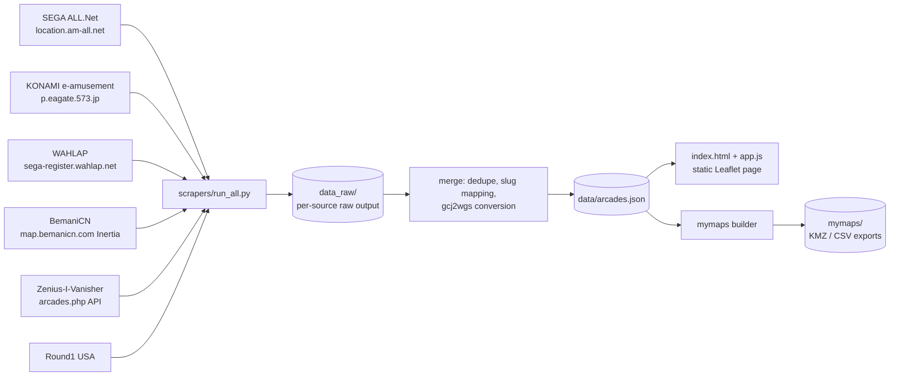

# Architecture

## Pipeline



One weekly GitHub Action (see `docs/UPDATING.md`) runs the whole left
half and commits the results; the static site and the exported KMZ/CSV
files are pure functions of `data/arcades.json`.

## Schema reference: `data/arcades.json`

```
{"updated": "2026-07-27",
 "counts": {"total": int,
            "by_game": {slug: int},
            "by_source": {src: int},
            "by_country": {country: int}},
 "arcades": [
  {"id": int (sequential after sorting by country,name,addr;
   renumbered on each refresh),
   "name": str,
   "addr": str (original language),
   "lat": float|null,
   "lng": float|null (WGS-84 ONLY; convert gcj02 via embedded
          eviltransform gcj2wgs before writing; (0,0) or missing
          means null),
   "country": str (English: "Japan","China","Taiwan","United States",...),
   "pref": str|null (JP prefecture / CN province / US state where known,
           original language ok),
   "games": [slug array, non-empty],
   "cabs": [variant slugs among: sdvx_vm, iidx_lm, ddr_gold,
            gitadora_gf_arena, gitadora_dm_arena, popn_pikapika],
   "src": [ids among: allnet, eagate, wahlap, ziv, round1usa,
           bemanicn, community],
   "links": {"gmaps": str|null, "ziv": str|null, "bemanicn": str|null},
   "notes": str|null}
 ]}
```

### Game slugs (canonical, used by the site layers too)

`maimai_dx, chunithm, ongeki, project_diva, sdvx, iidx, ddr,
polaris_chord, gitadora, jubeat, popn, nostalgia, drs, dance_around,
dance_evo, museca, reflec, taiko, other`

### Source-to-slug mapping

- `maimai_jp` + `maimai_intl` + WAHLAP `maidx` -> `maimai_dx`
- `chunithm_jp` + `chunithm_intl` + WAHLAP `midtr` -> `chunithm`
- `gitadora_gf` / `gitadora_dm` (+ arena variants) -> `gitadora`, with
  the arena variants recorded in `cabs`
- `sdvx_vm` implies game `sdvx` + cab `sdvx_vm`
- `iidx_lm` implies game `iidx` + cab `iidx_lm`
- `ddr_gold` implies game `ddr` + cab `ddr_gold`
- `popn_pikapika` implies game `popn` + cab `popn_pikapika`

## Design decisions

### Why a static Leaflet page instead of Google My Maps

- Performance: My Maps degrades beyond a few thousand pins; this dataset
  is ~12,000 arcades and growing. Leaflet.markercluster with
  `chunkedLoading` handles that comfortably.
- Import limits: My Maps caps imports at 2,000 rows per layer and 10
  layers per map, so the full dataset does not fit as one map without
  awkward splitting.
- No automation: My Maps has no API; every refresh would be a manual
  browser import. A static page redeploys itself from
  `data/arcades.json` on every data commit.
- My Maps is still supported as a manual export target: the mymaps
  builder emits per-game KMZ/CSV files under `mymaps/`, each kept under
  the 2,000-row limit, for people who prefer the Google Maps app.

### Why not a claude.ai artifact

Artifacts run under a strict Content-Security-Policy that blocks all
requests to external hosts, including tile servers. A slippy map with no
basemap tiles is useless, so the site is a normal static page (GitHub
Pages) that may load OpenStreetMap tiles under the OSMF tile policy.

### Why conservative cross-source merging

The same arcade appears in multiple sources with different names
("Round1 Yokohama" vs a katakana name vs a ZIv nickname), different
address formats, and slightly different coordinates. A wrong merge is
worse than a duplicate: it silently attaches one store's game list to
another store and is hard to spot. So the merger only unifies entries on
strong evidence (very close coordinates plus name/address agreement) and
otherwise keeps both entries. Merged entries list every contributing
source in `src`. Expect some residual duplicates; that is by design.

### Why China entries can be coordinate-less

The official WAHLAP endpoint returns name, address, province, and
machine count but NO coordinates, and BemaniCN's public endpoints are
addresses + game lists only (its coordinate layers are login-walled).
Getting coordinates would require geocoding through a Chinese provider
(API key, quota, terms), and those return GCJ-02 anyway. Rather than publish guessed or shifted positions,
China entries without a trustworthy coordinate keep `lat`/`lng` = null;
the site lists them in a sidebar/search instead of pinning them wrongly.

### GCJ-02 in one paragraph

Chinese regulations require consumer map services in China (AMap,
Tencent, and anything geocoded through them) to use GCJ-02, a datum that
applies a deterministic pseudo-random offset to true WGS-84 positions
("Mars coordinates"). Plotting GCJ-02 values on an OSM basemap (which is
WGS-84) lands markers roughly 100-700 m off. The pipeline therefore
converts any GCJ-02-sourced coordinate with the vendored eviltransform
`gcj2wgs` before writing `data/arcades.json`, guarded by
`outOfChina` so non-China points are never double-converted. Baidu
coordinates (BD-09) would need `bd2wgs` instead. Coordinates from
SEGA/KONAMI pages, ZIv, and Round1 USA are already WGS-84 and are
written unchanged. `data/arcades.json` is WGS-84 only, always.
