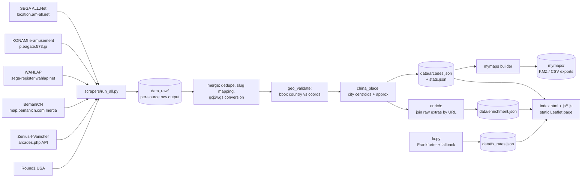
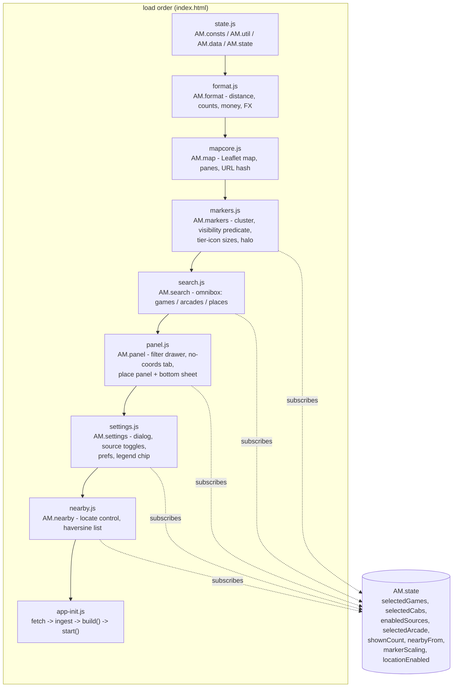

# Architecture

## Pipeline



One weekly GitHub Action (see `docs/UPDATING.md`) runs scrape -> merge (including geo validation, China approx placement, and enrichment) -> My Maps rebuild -> FX bake, then commits the results. The static site is a pure function of `data/arcades.json` plus on-demand `data/enrichment.json` and `data/fx_rates.json`. FX failure is non-fatal (previous rates retained).

### Merge stage order (inside `scrapers/merge.py`)

1. Load raw units, within-source dedupe, supersede bundled `community.json` rows when fresh files exist
2. Cross-source cluster / merge, optional coordinate inheritance
3. Assign sequential ids after sort by country, name, address
4. **`geo_validate`** - source-aware country vs bounding-box checks (official: null bad geocodes; community: fix wrong country labels)
5. **`china_place`** - for remaining coordinate-less China rows, resolve city centroid from `data/china_cities.json`, jitter cosmetically, set `approx: true` (never overwrites a real pin; never places Taiwan from this table)
6. Write `data/arcades.json` + `data/stats.json`
7. **`enrich.build_enrichment`** - join raw BemaniCN/ZIv extras onto merged ids via `links.*` URLs; write `data/enrichment.json` (does not mutate arcade rows)
8. Write `data/merge_log.json` (includes `geo_validation` and `china_approx` logs)

After merge returns, `run_all.py` rebuilds My Maps, then runs `fx.run` into `data/fx_rates.json`.

## Schema reference: `data/arcades.json`

```
{"updated": "2026-07-28",
 "counts": {"total": int,
            "by_game": {slug: int},
            "by_source": {src: int},
            "by_country": {country: int}},
 "arcades": [
  {"id": int (sequential after sorting by country,name,addr;
   renumbered on each refresh),
   "name": str,
   "addr": str (original language),
   "lat": float|null,
   "lng": float|null (WGS-84 ONLY; convert gcj02 via embedded
          eviltransform gcj2wgs before writing; (0,0) or missing
          means null). For China rows with approx:true these are
          city-centroid coordinates with cosmetic fan-out, NOT
          street-accurate pins,
   "country": str (English: "Japan","China","Taiwan","United States",...),
   "pref": str|null (JP prefecture / CN province / US state where known,
           original language ok),
   "games": [slug array, non-empty],
   "game_counts": {slug: int} (OPTIONAL - key absent when unknown;
          per-game machine counts, present only where a source
          reported them: BemaniCN per-title quantities and ZIv
          machine-list tallies, merged as per-slug max; every counted
          slug also appears in games; official sources publish no
          counts, so a store can list games without counts),
   "counts_src": "bemanicn"|"ziv"|null (OPTIONAL - present only when
          some source reported counts for this arcade. Names which
          source the surviving game_counts came from; BemaniCN wins
          when both contributed. null means counts existed but were
          ZIv placeholders (every per-game tally == 1, which is ZIv's
          baseline one-row-per-game-version shape rather than a real
          quantity) and were DROPPED, so game_counts is absent and
          nothing renders as "x1". ZIv counts survive only when some
          slug is >= 2, which proves the list was really tallied. Key
          absent entirely = no source ever counted this arcade, which
          is distinct from a suppressed placeholder.
          Invariant: game_counts present <=> counts_src is non-null.
          Dropping counts never drops games),
   "cabs": [variant slugs among: sdvx_vm, iidx_lm, ddr_gold,
            gitadora_gf_arena, gitadora_dm_arena, popn_pikapika],
   "src": [ids among: allnet, eagate, wahlap, ziv, round1usa,
           bemanicn, community],
   "links": {"gmaps": str|null, "ziv": str|null, "bemanicn": str|null},
   "notes": str|null,
   "approx": true (OPTIONAL - present only when china_place assigned
          a city-centroid pin; never set on real / inherited coords)}
 ]}
```

### `approx` field semantics

- Present and `true` only after successful city-centroid placement.
- Means: "somewhere in this city (or municipality district), addresses authoritative; pin is not a surveyed storefront."
- Fan-out offset is deterministic from name+address (not id) so weekly renumbering does not jump pins, and is purely cosmetic.
- Entries that stay coordinate-less have no `approx` key and `lat`/`lng` null (sidebar / no-coords list).
- `links.gmaps` for those rows stays a name+address search URL; merge deliberately does not rewrite it to the centroid pin.

### Game slugs (canonical, used by the site layers too)

`maimai_dx, chunithm, ongeki, project_diva, sdvx, iidx, ddr,
polaris_chord, gitadora, jubeat, popn, nostalgia, drs, dance_around,
dance_evo, museca, reflec, taiko, other`

### Source-to-slug mapping

- `maimai_jp` + `maimai_intl` + WAHLAP `maidx` -> `maimai_dx`
- `chunithm_jp` + `chunithm_intl` + WAHLAP `midtr` -> `chunithm`
- `gitadora_gf` / `gitadora_dm` (+ arena variants) -> `gitadora`, with
  the arena variants recorded in `cabs`
- `sdvx_vm` implies game `sdvx` + cab `sdvx_vm`
- `iidx_lm` implies game `iidx` + cab `iidx_lm`
- `ddr_gold` implies game `ddr` + cab `ddr_gold`
- `popn_pikapika` implies game `popn` + cab `popn_pikapika`
- US ZIv extra series (Pump It Up, ITG, StepManiaX, etc.) map to `other` only

## Schema reference: `data/enrichment.json`

Kept **separate** from `arcades.json` so the file every visitor downloads on first paint stays lean. The frontend fetches enrichment on demand (detail panel / price display).

Rationale for the split:

- Transit prose, multi-image URL lists, and free-text price strings are bulky relative to name/address/coords.
- Only about half of arcades have anything enrichable; a sparse side file avoids null-padding 13k rows.
- Signed BemaniCN OSS thumbs expire; isolating them makes staleness easier to reason about (`enriched_at` + 403 tolerance).

Shape (see also `scrapers/enrich.py` docstring and `docs/DATA_SOURCES.md` section 10):

```
{"updated": str,
 "price_defaults": {ISO2: {... typical country defaults ...}},
 "country_to_code": {country name: ISO2},
 "counts": {...},
 "arcades": {"<id>": {
    "transport", "price_text", "pay_type", "hours", "hours_text",
    "images", "fav_count", "game_prices", "game_versions",
    "machine_prices", "website", "info_text",
    "sources": {field: "bemanicn"|"ziv"},
    "enriched_at": "YYYY-MM-DD"
 }}}
```

Join is by stable source URLs (`links.bemanicn` / `links.ziv`), not by fragile name matching, so enrichment does not need to participate in clustering.

## Schema reference: `data/fx_rates.json`

```
{"base": "USD",
 "date": "YYYY-MM-DD",
 "rates": {CODE: float, ...},
 "source": "frankfurter+open.er-api.com" | "frankfurter" | ...,
 "sources": {CODE: "frankfurter"|"open.er-api.com"|"base"},
 "fetched_at": "ISO-8601 Z"}
```

Client multiplies local price estimates by these rates. Missing exotic codes are gap-filled from the fallback feed; total failure leaves the previous file untouched.

## Frontend modules (`js/`)

No build step, no bundler, no framework. `index.html` loads vendored Leaflet
plus nine plain scripts, each an IIFE that hangs one namespace off the global
`AM` object. Everything is served exactly as it sits in the repo.



### Load-order invariant (do not "tidy" this)

`markers.js` captures `AM.format` and `AM.map.map` into locals at IIFE parse
time, not lazily inside its functions. **`format.js` and `mapcore.js` must
therefore both be evaluated before `markers.js`.** Reordering to the
alphabetical-looking `state, mapcore, markers, format, ...` was tried and
measured: the page boots to `data load failed`, 0 markers, no place panel and
no settings gear, and because `app-init.js` swallows the throw in its
`.catch(fail)` the console stays completely silent. A silent break is easy to
reintroduce, so treat this ordering as load-bearing.

### State-event contract

Modules never call each other's render functions. Each one reads from
`AM.state` and re-renders off state events, so a feature can be removed by
deleting its script tag without editing the others.

`state.set(key, value, meta)` normally no-ops when the value is unchanged.
`meta.focus` deliberately bypasses that guard: focusing a store is a command
("show me this"), not a state change, so re-picking the store you are already
on still flies, re-halos and re-opens the panel.

### Cross-module seams

| Seam | Written by | Reacted to by |
| --- | --- | --- |
| `selectedArcade` | marker click (cluster-level handler resolving `__amId`), omnibox arcade row, nearby row, no-coords row, `#arcade=` hash | `panel.js` opens the place panel; `markers.js` flies + halos when `meta.focus`; `nearby.js` steps aside for coordinate-less stores |
| `nearbyFrom` `{lat, lng, label}` | place panel Nearby button | `nearby.js` opens the list; optional listener, so nothing breaks if that module is absent |
| `enabledSources` | settings source toggles | `markers.js` re-filters, `nearby.js` re-ranks, `search.js` invalidates cached per-game counts |
| `selectedGames` / `selectedCabs` | filter chips, omnibox game row, URL hash | markers, nearby, search, panel chips |
| `markerScaling`, `locationEnabled` | settings prefs | `markers.js` resizes every dot; `nearby.js` adds or removes the locate control |

`#pane-nearby` overlays `#pane-filters` in the same left column, so the place
panel's back control is labelled from whichever surface is actually underneath
("Filters" or "Nearby") rather than from a fixed string.

Escape peels exactly one layer per press: the settings `<dialog>` is a native
modal in the browser's top layer and closes itself, so the place panel skips
its own Escape handler while that dialog is open.

### Marker size classes have one owner

`markers.js` exports `SIZE_CLASSES` and `UNKNOWN_CLASS`. Both legends (the
on-map chip and Settings > About) render their thresholds and sample dot
diameters from those exports. Never restate the bands as literals - a
hard-coded copy had already drifted out of step with the real bands.

Unknown is deliberately the middle size, never the smallest: most official
listings publish which games a store has but not how many cabinets, and
drawing "unknown" smallest would read as "this store is tiny".

## Design decisions

### Why a static Leaflet page instead of Google My Maps

- Performance: My Maps degrades beyond a few thousand pins; this dataset
  is ~14,000 arcades and growing. Leaflet.markercluster with
  `chunkedLoading` handles that comfortably.
- Import limits: My Maps caps imports at 2,000 rows per layer and 10
  layers per map, so the full dataset does not fit as one map without
  awkward splitting.
- No automation: My Maps has no API; every refresh would be a manual
  browser import. A static page redeploys itself from
  `data/arcades.json` on every data commit.
- My Maps is still supported as a manual export target: the mymaps
  builder emits per-game KMZ/CSV files under `mymaps/`, each kept under
  the 2,000-row limit, for people who prefer the Google Maps app.

### Why not a claude.ai artifact

Artifacts run under a strict Content-Security-Policy that blocks all
requests to external hosts, including tile servers. A slippy map with no
basemap tiles is useless, so the site is a normal static page (GitHub
Pages) that may load OpenStreetMap tiles under the OSMF tile policy.

### Why conservative cross-source merging

The same arcade appears in multiple sources with different names
("Round1 Yokohama" vs a katakana name vs a ZIv nickname), different
address formats, and slightly different coordinates. A wrong merge is
worse than a duplicate: it silently attaches one store's game list to
another store and is hard to spot. So the merger only unifies entries on
strong evidence (very close coordinates plus name/address agreement) and
otherwise keeps both entries. Merged entries list every contributing
source in `src`. Expect some residual duplicates; that is by design.

### Why a fresh scrape supersedes the bundled community rows

`data_raw/community.json` is a committed bundle that carries rows from
three sources at once (`ziv`, `round1usa`, and a few curated
`community` entries). When a per-source scraper writes its own fresh
file (`data_raw/ziv.json`, `data_raw/round1usa.json`), the merger skips
that source's rows inside `community.json` and takes only the fresh
file. Without this the two copies of ZIv would BOTH load: the same
arcade is spelled differently between them (the API's address parts are
joined differently now, e.g. `"1 Old St, Tokyo"` vs
`"1 Old St Tokyo, Tokyo"`), so the within-source dedupe key
`(source, name, addr)` does not collapse them and ZIv would silently
double to ~9.5k entries.

The skip is keyed on the ROW's `source` field, not on the file, so
`round1usa` and curated `community` rows inside `community.json` are
still ingested; and it only engages when the fresh file actually
exists, so a checkout without it still gets the bundled rows. The count
of superseded rows is written to `data/merge_log.json` as
`community_rows_superseded`.

### Why China entries use approx city centroids (and still can be coordinate-less)

The official WAHLAP endpoint returns name, address, province, and
machine count but NO coordinates, and BemaniCN's public endpoints are
addresses + game lists only (its coordinate layers are login-walled).
Commercial Chinese geocoders need API keys, quotas, and still return
GCJ-02. Rather than leave ~5.9k China stores invisible, `china_place`
assigns **city-level** WGS-84 centroids from `data/china_cities.json` and
marks them `approx: true`. Unresolved rows keep `lat`/`lng` = null and
appear in the no-coords list. Addresses remain authoritative for
navigation. See the README China accuracy disclosure.

### GCJ-02 in one paragraph

Chinese regulations require consumer map services in China (AMap,
Tencent, and anything geocoded through them) to use GCJ-02, a datum that
applies a deterministic pseudo-random offset to true WGS-84 positions
("Mars coordinates"). Plotting GCJ-02 values on an OSM basemap (which is
WGS-84) lands markers roughly 100-700 m off. The pipeline therefore
converts any GCJ-02-sourced coordinate with the vendored eviltransform
`gcj2wgs` before writing `data/arcades.json`, guarded by
`outOfChina` so non-China points are never double-converted. The
`china_cities.json` table is pre-converted the same way at build time.
Baidu coordinates (BD-09) would need `bd2wgs` instead. Coordinates from
SEGA/KONAMI pages, ZIv, and Round1 USA are already WGS-84 and are
written unchanged. `data/arcades.json` is WGS-84 only, always.

### Why enrichment and FX are separate files

`arcades.json` is the critical path for map markers. Enrichment is
optional UI detail; FX is a tiny weekly rates blob. Isolating them keeps
first paint small, lets FX fail without blocking arcade commits, and
makes it obvious which fields can go stale (`enriched_at`, signed image
URLs, ECB rate date).
